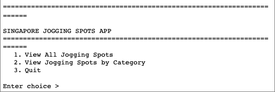
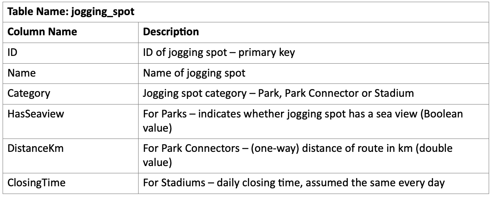
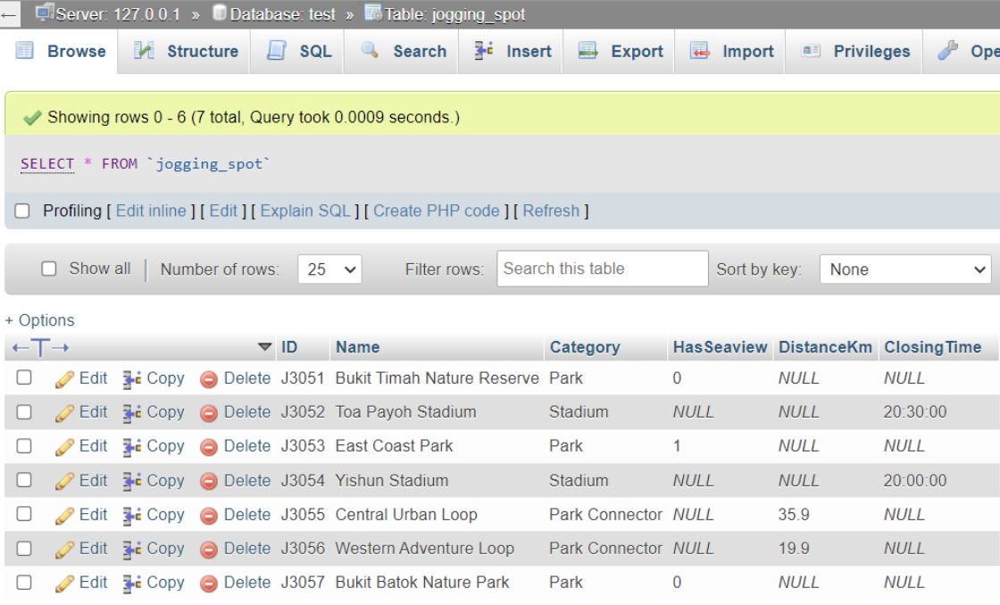
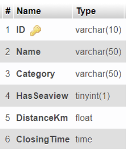
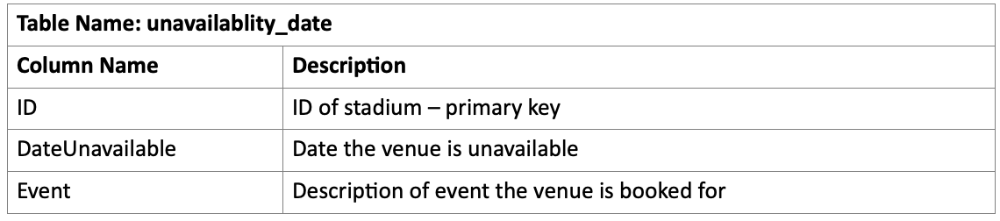
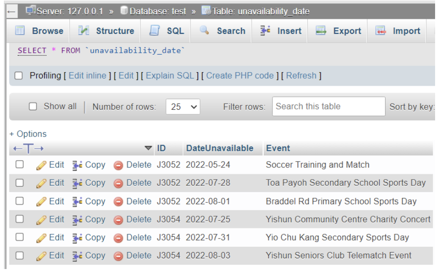
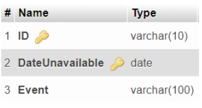
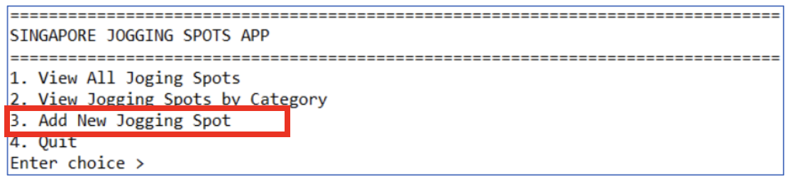
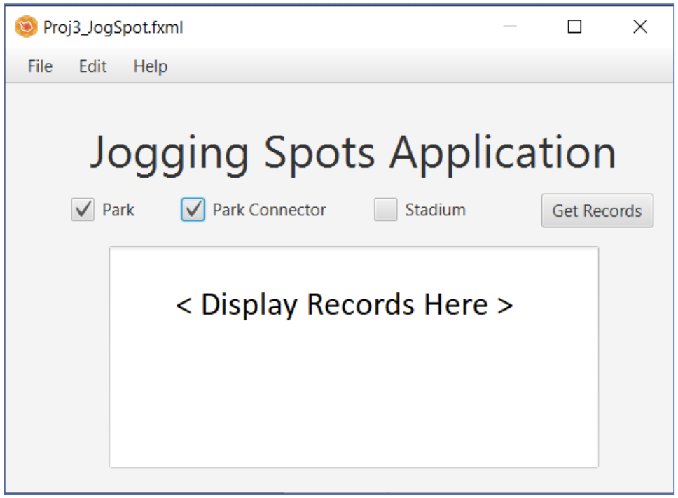

# rp-project-jogging-spots-app

# Singapore Jogging Spots App - Part 1

### Description

You are to create an application to keep track of the jogging spots in Singapore. There are three categories: **Parks, Park Connectors, and Stadiums**.

You have to implement a **menu-driven application** with the features shown in image/fig 1 below:

#### Sample Menu-driven Application

For Part 1 of the Graded Assignment, you are to create a menu-driven application that would only perform **view functions**. **Add functions are NOT required**; they will be implemented only in Part 2 of the project.

1. **View All Jogging Spots** – This function should display the relevant details (which will be elaborated in the following sections) about each jogging spot.

2. **View Jogging Spots by Category** – This function should display a sub-menu and prompt the user to select the category of jogging spot to display, and then show the relevant details for all jogging spots in that category.

3. **Quit** – This function should terminate the program.

---

### Requirements

- Every jogging spot record should **capture the ID** and **name of the jogging spot**.
- For **Park** records, the application has to also capture whether **the jogging spot has a seaview (Boolean value)**.
- For **Park Connector** records, the application has to also capture **the route distance in km (double value)**.
- For **Stadium** records, the application has to also capture **the closing time, assumed to be the same every day**.
- Database Tables and Fields:
  - The following information describes one possible example to implement the requirements described above.
  - Two tables will be used. The **jogging_spot** table will store all the data about the jogging spots, except the unavailability dates for stadiums (when booked for functions and closed to joggers). These unavailability dates will be stored separately in the **unavailability_date** table.
  - You are free to use them or improve on them by implementing your own database tables and fields.

---

##### Sample Data and Column Data Types of jogging_spot Table

##### Sample data and column data types of unavailablity_date table

---

#### Section A

- Complete the following tasks:
  - Set up the database to support the application
  - Write a **menu-driven application** (ref. Fig 1 above) to display jogging spot records for all jogging spots and according to jogging spot categories

---

#### Section B

- Complete the following tasks:

  - Create classes for each jogging spot category, namely **Park, ParkConnector, and Stadium**.
  - **Create an abstract parent class for these classes named JoggingSpot.**
  - Implement **constructors** and **getter methods** for every field in each class.

  - Create an interface **Unavailability**, which **contains one public method `announceUnavailability()`**. This interface should be implemented by the **Stadium** class to do the following tasks:

    - Retrieve unavailability dates for the current stadium, from today to two weeks into the future, from the `unavailability_date` table
    - Display the unavailability announcement, if any
    - **`announceUnavailability()` should be used when displaying stadium info**

  - Draw the **class diagram** for the above interface and classes:

    - You can draw on paper, take a photo, and attach it to an MS Word document, or
    - Draw using MS Word or other suitable tools.

  - Write code for the above three classes.

---

- Enhance code in **Section A** with the following points:

  - Create an **ArrayList of JoggingSpot objects**
  - For each record from the **`jogging_spot`** table, create either a **Park, ParkConnector, or Stadium** object to store the fields in that record
  - Add the object into the **ArrayList of JoggingSpot objects**
  - **Use the values stored in the ArrayList objects to display the relevant results to the user (instead of reading directly from the database for every user request).**

  # Singapore Jogging Spots App - Part 2

### Recap of Part 1

You created an application to keep track of jogging spots in Singapore. There are three categories: Parks, Park Connectors and Stadiums.

For Part 1 of the Graded Assignment, you created a menu-driven application that would only perform view functions, add functions were NOT required.

The add functions will be implemented in Part 2 of the project. Refer to Part 1 when necessary for the details of the database tables and the application requirements.

---

#### Section C

- Implement a new option in your menu-driven application to add new jogging spots, as shown in Fig 8 option 3:

  

- Your option to add new members should prompt the user to enter the relevant information, to create members of any category (Park, Park Connector or Stadium) as required by the user.

- After successful addition of a new member, the details of the new member should be viewable from the View options of the application, i.e. option 1 to view all members, and option 2 to view members by category.

---

#### Section D

1. Create the JavaFX version of this application, similar to that given in Fig 9 below. Fig 9 is just a suggestion, and you are encouraged to improve on the layout and functionality.

   - You should design the user interface (UI) such that it is user-friendly and promotes readability of the content.

##### Sample GUI Application to Get Database Records

2. “Wow” factor – using your creativity and innovation, add functionality to your application to make it “special”. Before proceeding, do discuss with your lecturer to ensure that the scope and difficulty level of your “Wow” factor is appropriate for your application.

   Some possible areas include:

   - Add, update, delete functions using JavaFX
   - Regular expression (e.g. for filtering, validation)
   - Advanced JavaFX features
   - Advanced sorting features
