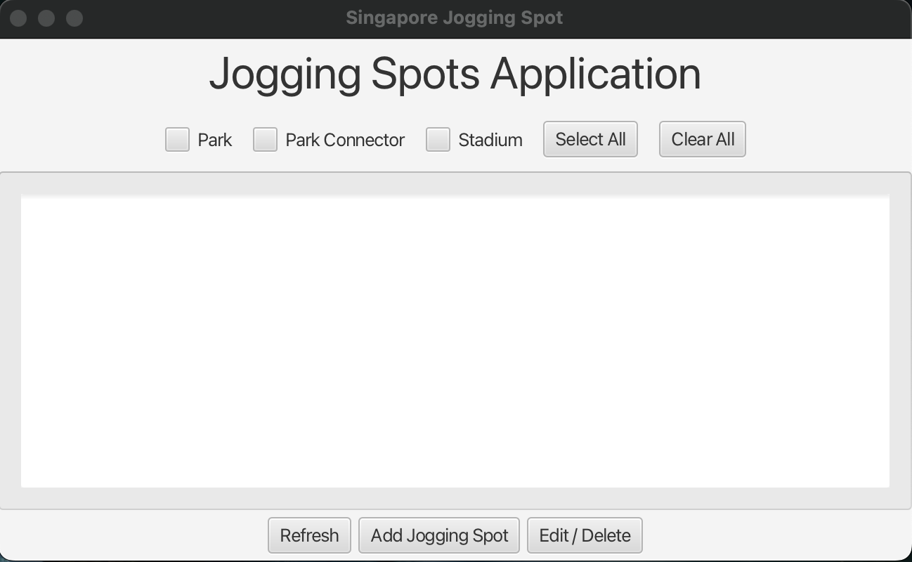
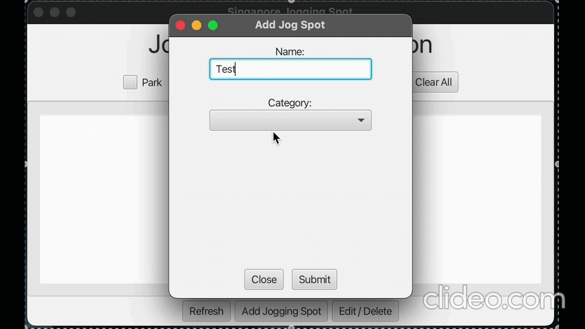
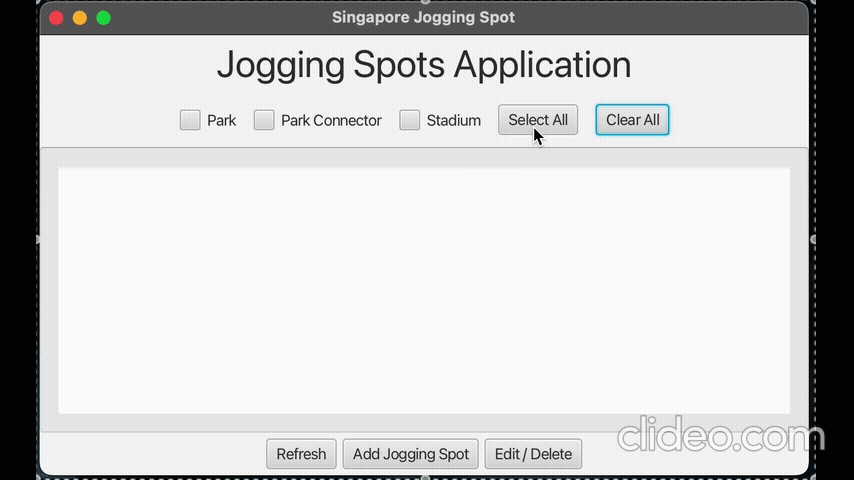

# rp-project-jogging-spots-app

# Singapore Jogging Spots Application

  
_A Java application to track jogging spots across Singapore with console and GUI interfaces._

## 🎥 Live Demo

| Add New Spot                               | Browse/Filter Spots                        |
| ------------------------------------------ | ------------------------------------------ |
|  |  |

## 📌 Project Overview

- **Purpose**: Manage jogging spots (Parks, Park Connectors, Stadiums) with CRUD operations.
- **Key Features**:
  - **Add spots** with category-specific attributes (seaviews, distances, closing times).
  - **Filter spots** by category (Park/Connector/Stadium) or view all.
  - **Stadium closures**: Integrated announcements via MySQL.
- **OOP Design**:  
  

## 🛠 Tech Stack

- **Backend**: Java, MySQL (Dockerized)
- **Frontend**: JavaFX

## 🚀 Why This Project?

- Demonstrates **full-stack Java** skills (OOP + DB + GUI).
- Shows **problem-solving** (e.g., dynamic forms for different spot categories).
- **Recruiter-ready**: Clean UI, documented design, and deployable via Docker.
